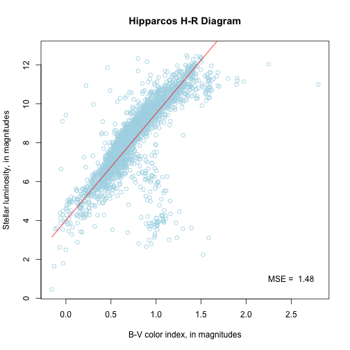

---
title       : Hertzprung-Russell Diagram Using Hipparcos Data
subtitle    : 
author      : Ruben Gamboa
job         : Jelm Skies Observatory
logo        : uw-logo-small-125x85.png
biglogo     : HRDiagram.png
framework   : io2012   # {io2012, html5slides, shower, dzslides, ...}
highlighter : highlight.js  # {highlight.js, prettify, highlight}
hitheme     : tomorrow      # 
widgets     : [mathjax, bootstrap] # {mathjax, quiz, bootstrap}
mode        : selfcontained # {standalone, draft}
--- {
    tpl: twocol
}

## Hipparcos Satellite

*** =left

* The Hipparcos Satellite was launched by the European Space Agency in 1989 and remained in operation until 1993
* Its mission was to take detailed, three-dimensional positions of more than 100,000 stars
* To take the position along the third (radial) dimension, Hipparcos took the spectra of stars
* This means that the resulting catalog of over 100,000 stars has excellent measurements of the stars' position, luminosities, and spectral types
* The last two values are derived from each star's spectra

*** =right

--- {
    tpl: twocol
}

## Hertzprung-Russell Diagrams

*** =left

* A Hertzprung-Russell Diagram or HR Diagram is a scatter-plot of a star's color vs. its luminosity
* Luminosities are measured in magnitudes, and *higher* values indicate *lower* luminosity
* Color is measured by a color index, the difference in magnitudes in two distinct colors, e.g., Blue-Violet
* Color indicates the star's temperature, which relates to its spectral class for Main Sequence stars
* In the diagram, hotter (hence more violet) stars lie towards the left,
  and more luminous (hence low magnitude) stars lie towards the bottom

*** =right

 

--- {
    tpl: twocol
}

## Hertzprung-Russell Tool

*** =left

* The [Hipparcos HR Diagram Tool](https://rubengamboa.shinyapps.io/hipparcos-hr-diagram/) displays
  an HR diagram compiled from data from the Hipparcos satellite
* The tool lets you try to find a linear relationship between the color and luminosity of the stars,
  such as shown in the diagram on the right
* Your fit should be better than a simple regression through all the points, since the relationship 
  only holds for Main Sequence stars, and the Hipparcos data includes many stars that are off the
  Main Sequence, e.g., giant stars below and white dwarves above

*** =right

 
